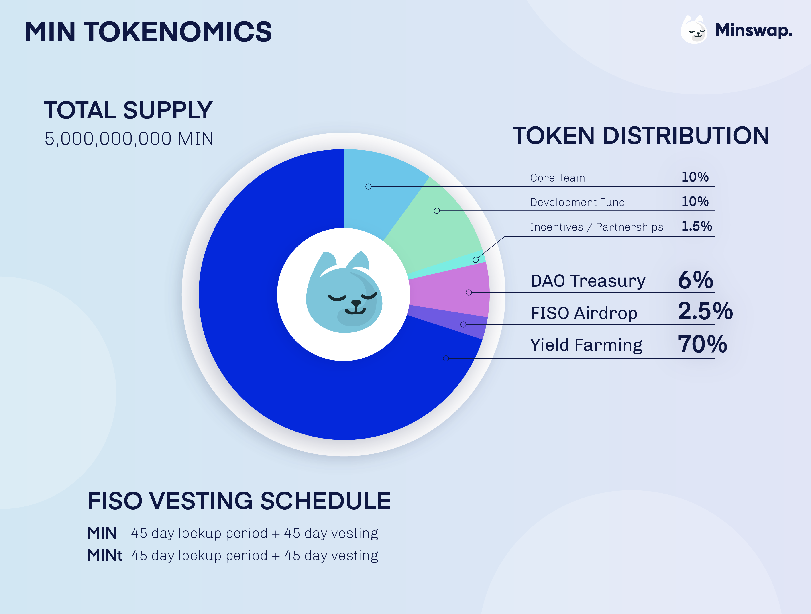

# Introduction

Minswap is a Decentralized Exchange (DEX). The purpose of a DEX is to enable permissionless trading of token pairs. For each swap, a fee is taken, which goes to the Liquidity Providers (LPs). Anyone can provide Liquidity as well, hence profits are decentralized. Minswap is a community-centric DEX, in that our tokens are fairly distributed, without any private or VC investment. Minswap has pioneered several ideas in the Cardano ecosystem such as the FISO model, touted as the fairest ISO model in the Cardano community, and we plan to continue developing several value adding features once we have launched the DEX. This will benefit both the Minswap community, and the Cardano community as a whole.&#x20;

## Features

* **Community First:** MIN tokens are distributed fairly to protocol participants and Liquidity Providers, who can participate in [governance](https://forum.minswap.org/) and vote democratically on protocol changes.&#x20;
* **Innovation-Driven:** We pioneered ideas such as the [FISO](https://medium.com/minswap/minswap-fair-launch-tokenomics-and-fiso-airdrop-start-date-a75f3e75a546) model or the [MINt](https://forum.minswap.org/t/mint-token-expose-mint-liquidity-providers-to-other-pairs/40) token, and plan to continue doing so with further novel initiatives.
* **Launchpool:** Minswap is permissionless, meaning anybody can list tokens without needing KYC. Moreover, there will be lots of Cardano DeFi users looking for a place to trade new tokens, thus we plan to foster these new projects in the Cardano ecosystem offering Initial DEX Offering (IDO) and Initial Farm Offering (IFO).&#x20;
* **Stake Pool Operators Support:** Minswap supported SPOs through the FISO and plans to continue doing so with a community-oriented ADA delegation policy, incentivizing SPOs in our batching solution [Laminar](https://medium.com/minswap/introducing-laminar-an-eutxo-scaling-protocol-for-accounting-style-smart-contract-d1ac8847dde8), and by enabling automatic native token fees conversion (Babel Fees).&#x20;
* **Ethereum Compatible**: With the ERC-20 Converter, users can trade Ethereum tokens at much lower fees. &#x20;

## Roadmap

* **Q2 2021:** Successfully received funds in [Catalyst Fund 5](https://drive.google.com/file/d/1Wp4ypNhssUwOBC9SLkxKgtyJaZ2h0fwl/view), commenced research on constant-product pool, completed [Plutus Pioneer Program](https://testnets.cardano.org/en/plutus-pioneer-program/).
* **Q3 2021:** Deployed Minswap testnet and gathered invaluable [feedback](https://medium.com/minswap/minswap-testnet-reflections-64b01c5e7c45). Launched FISO model, a novel way to distribute tokens to community members. Introduced the MINt token mechanic, ensuring FISO participants are incentivized to partake in the protocol once launched.&#x20;
* **Q4 2021:** Published Minswap´s solution to concurrency, Laminar, which aims to execute accounting-style smart contracts multiple times in one block, without sacrificing decentralization. Raised funds in the [public sale](https://medium.com/minswap/minswap-public-sale-8732843af1bd) to strengthen team and development.&#x20;
* **Q1 2022:** After completion of a Security Audit, Minswap will launch on Mainnet. Liquidity Mining incentives will be implemented soon after.
* **Q2 2022:** Minswap will embrace Community Governance through a DAO, and introduce novel features such as gamification or profit sharing.

## Token Distribution

78.5% of tokens will be distributed to the community, of which 70% are reserved to reward LPs, ensuring our community of users is maximally rewarded, not speculators and insiders.

