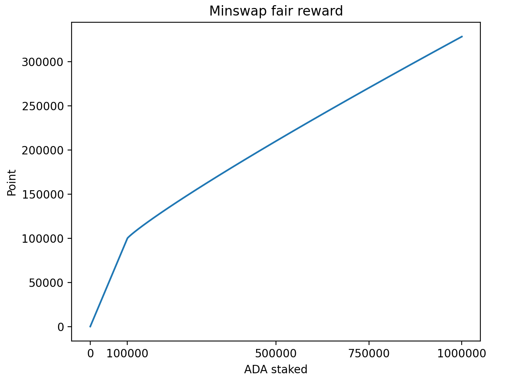
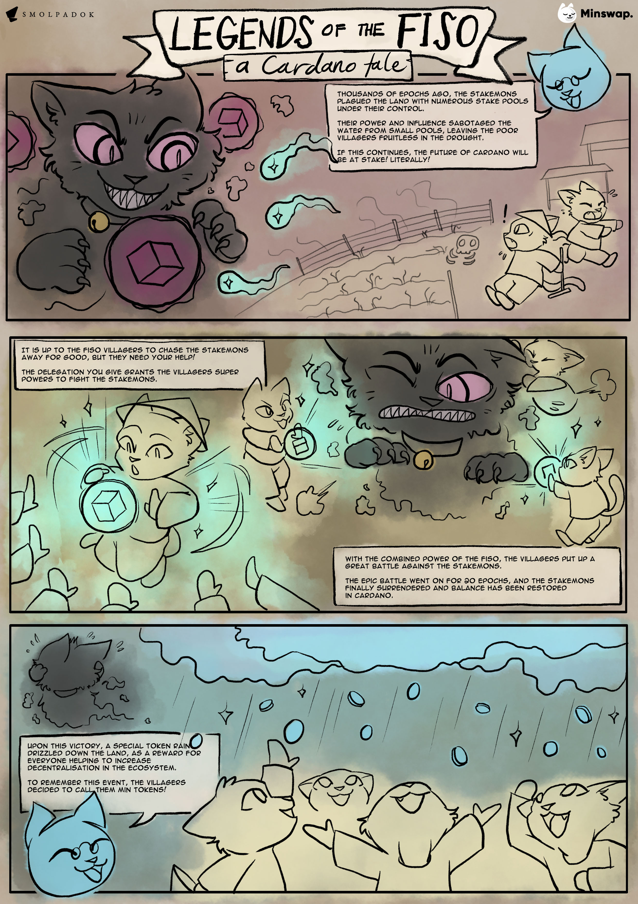

# FISO

### \*Disclaimer\*: our FISO campaign is now over. We have decided to preserve this page for anyone who has questions about how it was conducted.

### What is a FISO? Do you profit from it? Do I pay anything for it?

FISO stands for Fair Initial Stake Offering, it is a form of ISO in which rather than taking delegators away from SPOs for profit from margin fees, or even having a free ISO airdrop where delegators keep all ADA rewards which still takes delegators away from SPO, we instead feature 10 small stake pools to delegate towards and we also have 15 pools in reserve, by participating, you increase the decentralization of the network doing so, you pay no fees save for SPO margin fees which are capped for participating pools (read below for steps taken with pools in violation). You will also need to pay a transfer fee to receive MIN/MINt airdrops (more details on that below). We do not profit from this, but it does market us significantly.

### How were the participating pools chosen?

The entrants had to fill the following criteria:

1. Single-pool operators only
2. Pool size: 100k-2m ADA at time of snapshot
3. Fixed cost: 340 ADA
4. Minimum Pledge: 20k
5. Margin: less than 5%
6. Minimum of 1 block produced

All pools that fit that criteria at the time of snapshot were assigned a number 1 to n, then, the first transaction ID of epoch 281 was used to seed a Mersenne Twister random number generator and the first 10 numbers generated became our active pools, the next 15 became our reserve pools in a verifiably random selection process.

### How do I participate in the FISO?

Stake in one of the ten active pools we’ve partnered with, when all those reach 3 million ADA in delegation, we’ll open fifteen more reserve pools.

\*\*\*\*[**Click here to see the active pools**](https://fiso.minswap.org)\*\*\*\*

### How is the reward calculated?

125 million tokens total (2.5% of total supply) will be rewarded to the participants of Minswap’s FISO. Delegator rewards will consist of 80% MINt tokens and 20% MIN tokens. Each epoch of the FISO, 6.25 million tokens are rewarded to delegators. The number of tokens an individual receives is calculated by a scoring system that approximates, every epoch, the percentage of total FISO delegation that their ADA equals. The reason the scoring system is only an “approximation” of each participants percentage of total delegation per epoch is due to two mechanisms:

1. Whale Limiter.
2. Smallest Pool Reward.

_**Scoring System (used to calculate participant’s % of FISO rewards each epoch):**_

Under 100,000 ADA delegated: Total points = Total ADA

Over 100,000 ADA delegated: Total points = 100,000 + (Total ADA - 100,000) ^ 0.9

1.25X point multiplier for delegating to the smallest pool at the time of delegation. This multiplier will activate after 10 epochs and apply to all future epochs as long as the delegator stays in the same pool.

_**Example:**_

100K ADA = 100K Points

1M ADA \~ 328K Points

10M ADA \~ 2M Points

### So complicated, can you give me an example?

For example, at the end of epoch 285, there are only two delegators Long and Richard.

Long delegated 100k ADA, equal to 100k points.

Richard delegated 1M ADA, equal to around 328k points.

Total points of that epoch are 428k.

Long earn 100k / 428k = \~23% of the rewards, equal to 6.25M \* 23% = 1.46M tokens (20% MIN and 80% MINt).

Richard earn 328k / 428k = \~77% of the rewards, equal to 6.25M \* 77% = 4.79M tokens (20% MIN and 80% MINt).

### Can I earn the 25% multiplier bonus twice?

No. Jumping pool will reset the bonus and start the 10 epochs clock again.

### When does the FISO start? Do I need to get in early to earn max rewards?

It starts on August 18th. There’s no harm in delegating early but we are tracking Live Stake rather than the system ADA rewards work on, which means your delegation will count towards MIN airdrops immediately starting on the 18th, whether you bring the same delegation amount 2 weeks early or on the 18th, it will earn the same amount of MIN tokens overall.

### How long will the FISO last?

20 epochs.

### I heard something about going to a certain site and paying a transfer fee for MIN airdrops to actually hit my wallet? How much is the fee? Where do I go do that? Do I go to this place before the FISO, before every epoch, after every epoch, or after the FISO?

We will announce an official site for you to go to and claim airdrop after FISO ended. Because native tokens in Cardano need to be sent with at least \~1.5 ADA, you need to send us 2 ADA to cover for transaction fees and this minimum ADA requirements. We will send you back the airdrop attached with \~1.8 ADA. **All websites that are not announced on our #fiso-announcement Discord channel are scam!**

### **Can I delegate for less than 20 epochs?**

Yes, you will be rewarded for the epochs you delegate. All rewards will be claimable after FISO ended.

### What if one of the stake pools changes fees suddenly?

We will send out an alert on Twitter, Discord, Telegram, Facebook. It is recommended that you have a pool alert group/app installed as well. We will open a reserve pool early to replace the non-compliant pool. All information on pool changes or any urgent information pertaining to the FISO will be updated in our _#fiso-announcement_ Discord channel.

### I heard something about a “smallest pool multiplier”? How do I get that!? What if I’m at the smallest pool, and then it grows and another pool becomes smaller? What if the reserve pools open?

You can earn the ‘smallest pool multiplier’ by staking in the pool that has the smallest delegation at the time you stake. We expect that pool to change, don’t worry, you won’t lose your multiplier. We will track, through our scripts, what is the smallest pool at all times and the delegations made to this pool. However, you do have to keep your delegation staked in that pool for at least 10 epochs to begin earning the multiplier. So, the most epochs a person could earn the multiplier for would be the final 10 epochs. Shifting your stake around will only delay your multiplier as it would restart the clock on the ‘10-epoch same-pool requirement’.

Given that some people began to stake after the August 7th FISO pool announcement, we have decided to award them the multiplier if they entered the smallest pool. We will extend this to anyone who delegates to the smallest pool at any time from now until the start of the FISO on August 18th. However, the ‘10 epoch same-pool requirement’ calculation will not begin until FISO epoch 1. As such, early delegators to the smallest pool will have a small-pool multiplier as if they had delegated to the smallest pool in the first FISO epoch.

### Which wallets will be compatible with MIN tokens? I heard you made a wallet for testnet, is testnet related to FISO?

We will try to support every wallet out there, starting with Daedalus and Yoroi. As for the testnet wallet, it is a simple wallet made to sync with Minswap before Yoroi/Daedalus get further Alonzo capabilities, not meant to be permanent. The testnet is **not related** to the FISO, it is a separate airdrop.

### What if the small stake pool I delegate to doesn’t earn any blocks?

That will only affect your ADA rewards, it’s one of the reasons we implemented a smallest pool multiplier (see above) which boosts your MIN/MINt rewards. However, we believe that all the pools will fill up rather quickly and ADA blocks won’t be a problem. We are also only opening 10 pools in the beginning to be sure each one reaches the 2-3 million delegation necessary to mint blocks consistently.

### If my pool goes over 3 million ADA are my MIN rewards reduced?

No. If all 10 go over 3 million ADA the 15 reserve pools are opened. It will not affect your rewards.

### What is MINt, why do I get the majority of my rewards in MINt rather than MIN? Is a MINt/ADA pool different than a MIN/ADA pool? What is the 45 day lockup?

MINt is a token that converts into MIN if locked in a contract with ADA for 45 days. Upon seeding MINt and ADA through our designated converter interface on the Minswap app, a MINx/ADA LP token will be minted and locked for 45 days. The ‘x’ indicates a multiplier for yield farming rewards on top of the normal MIN/ADA LP rate. After 45 days, you can withdraw your ADA and newly minted MIN tokens. The amount of ADA and MIN you can withdraw gradually increase on an additional 45 days linear vesting period, after 45 days of linear vesting, you can withdraw 100% of your ADA and MIN. The intention of the MINt token is to encourage people to participate in the protocol and interact with our application. It should be reiterated that MINt tokens are locked then converted only when entered into a contract through our designated conversion interface. It is possible to create a MINt/ADA, or MINt/Any-Other-Asset, pair to trade MINt. However, after 73 epochs the converter will no longer work. The latest any new MIN will begin vesting from MINt conversions will be epoch 82 (epoch 73 deposit + 45 days).

### What is the implication of impermanent loss (IL) in locking up ADA and MINt in ADA/MIN pool?

Impermanent loss occurs when pair price moves against each other. However, traditional understanding of IL will not work the same for MINt case because one side of the pair (MINt) is the tokens you get for free and has a different market traded price compared to MIN. When you lock up ADA and MINt in ADA/MIN pool, two cases can happen:

* MIN price goes up, this results in your locked ADA amount goes up.
* MIN price goes down, this results in your locked ADA amount goes down.

This happens due to the nature of how constant-product AMM works. If you LP early, high chances are MIN price will go up against ADA, which result in you walking away with more ADA than you initially deposit. In the opposite case, which is unlikely, you get compensated with the new MIN tokens from yield farming. Note that the LP tokens from locking ADA and MINt will have one of the highest yield farm APY in the beginning.

### Will a rewards tracker/calculator be provided?

It should be by the beginning of the FISO.

### Can people in the US participate?

Yes.

### How will you prevent whales grabbing all the tokens?

We reduce additional rewards given as ADA delegated increases. This is not a perfect fail-safe, but it is inconvenient enough to prevent it from being worth it. The equation for delegation over 100K ADA can be found in our previous question.

### What percentage of your total tokens is the FISO airdrop?

2.5%, we want the vast majority of our tokens to be earned via yield farming, since this is free and DEXes need stable token prices created by yield farming holders to serve their users, having a bunch of tokens bought or held by the team or given out for free would impede a DEXes functionality.

### What are the tokenomics so that we can have some context?

**Us:** 10% Core team (what we’re holding onto), 10% Development Fund (self-explanatory), 1.5% Incentives/Partnerships.

**You:** 6% DAO Treasury, 2.5% FISO Airdrop, 70% Yield Farming.

### Tell me more about the DAO Treasury!

The DAO treasury is our community fund that is accessible only by our future, fully-decentralized DAO. Due to our vesting governance period there are varying levels of decentralization during the first few years after launch. You can read more about this in our governance docs. While DAO governance guides all decisions, including the provision of tokens, from day one, we wanted to reserve a portion controlled only by a fully decentralized DAO.

### Will our FISO tokens have to be redeemed by a certain time?

Yes, FISO tokens must be redeemed no later than 10 epochs after the FISO ends. After this we will shut down that claim system.

### Does reward calculation count IOG delegation?

Yes, FISO reward calculation will count delegation from IOG wallets as well. If there are too many unclaimed tokens after FISO, we will use them to incentivize LPs or bug bounty. The potential uses of unclaimed tokens will be proposed and discussed on our governance forum.

### Will there be a general Minswap FAQ?

Yes, it is [here](general.md).

### Where can I find the original announcements?

[Fair ISO application for stake pool operators begins now!](https://medium.com/minswap/fair-iso-application-for-stake-pool-operators-begins-now-e6d563f85eec)

[Minswap fair tokenomics and FISO airdrop start date](https://medium.com/minswap/minswap-fair-launch-tokenomics-and-fiso-airdrop-start-date-a75f3e75a546)

### What is _Legends of the FISO_?

It's a cool comic in our comic series that we minted as NFTs.

## Disclaimer

**The content of the FAQ is for informational purposes only, you should not construe any such information or any material on the Minswap site as legal, investment, financial, or other advice. Your use of the Minswap protocol upon launch involves various risks, including, but not limited to, losses while digital assets are being supplied to the Minswap protocol and losses due to the fluctuation of prices of tokens in a trading pair or liquidity pool. Before using the Minswap protocol, you should review the relevant documentation to make sure you understand how the Minswap protocol works. Although Minswap Labs developed much of the initial code for the Minswap protocol, it does not provide, own, or control the Minswap protocol, which is run by smart contracts deployed on the Cardano blockchain. After launch, upgrades and modifications to the protocol will be managed in a community-driven way by holders of the MIN governance token. No developer or entity involved in creating the Minswap protocol will be liable for any claims or damages whatsoever associated with your use.**
