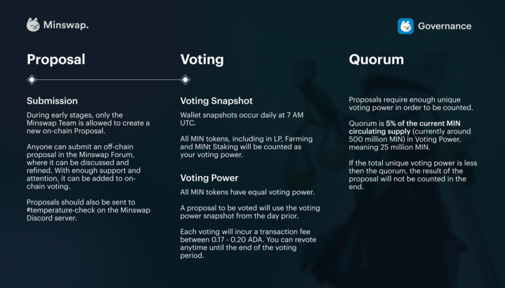

# Governance Module

Minswap is a community-centric DEX. From the onset, tokens are fairly distributed, without any private or VC investment. So far, the community has guided the future of the DEX by providing input in several discussions on the [Minswap Forum.](https://r.search.yahoo.com/\_ylt=Awr93JpybWFjxnAA6LoM34lQ;\_ylu=Y29sbwNncTEEcG9zAzEEdnRpZAMEc2VjA3Ny/RV=2/RE=1667358195/RO=10/RU=https%3a%2f%2fforum.minswap.org%2f/RK=2/RS=c8k92kBL1gmK.CaWcXAvD9LGOX0-) By implementing **on-chain snapshot voting**, Minswap moves a step closer towards being a decentralized protocol that is wholly owned by its users.

In this first phase of the Minswap Governance, the community will vote on major changes to the protocol, whereas smaller changes affecting operations, farm rebalances or onboarding of new farms, are decided on by the core team. While the vision and aim since the beginning for Minswap has been to be fully in the hands of the community, DAO governance is a nascent and evolving area. As such, the initial Phases of Minswap Governance will be experimental, up until the point where Minswap and its Governance has grown resistant enough to external factors & risks where it can be fully independent. Thus, the full adoption of **DAO governance** will be a progressive road.

<figure><figcaption></figcaption></figure>

The following are imporant Governance Links:

[Minswap Discord](https://discord.gg/minswap): where most of the informal discussion takes place

[Governance Forum](https://forum.minswap.org): a more formal avenue where anyone can post ideas to improve Minswap

[Voting Portal](https://app.minswap.org/gov): anyone can vote to implement ideas with their $MIN&#x20;
