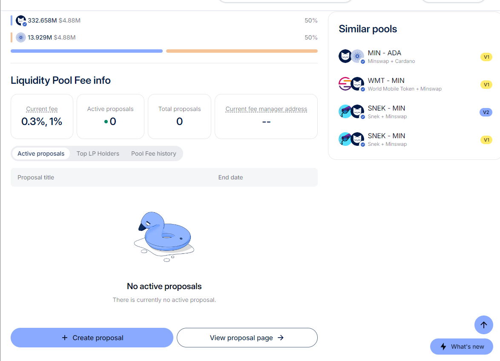
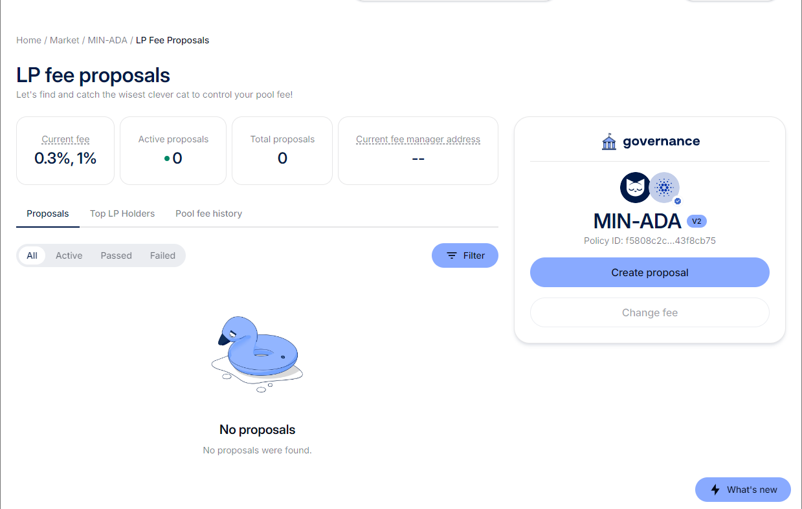
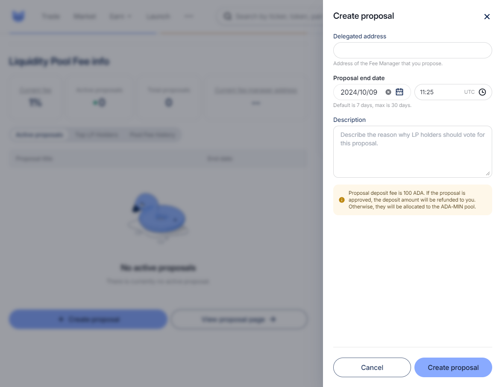
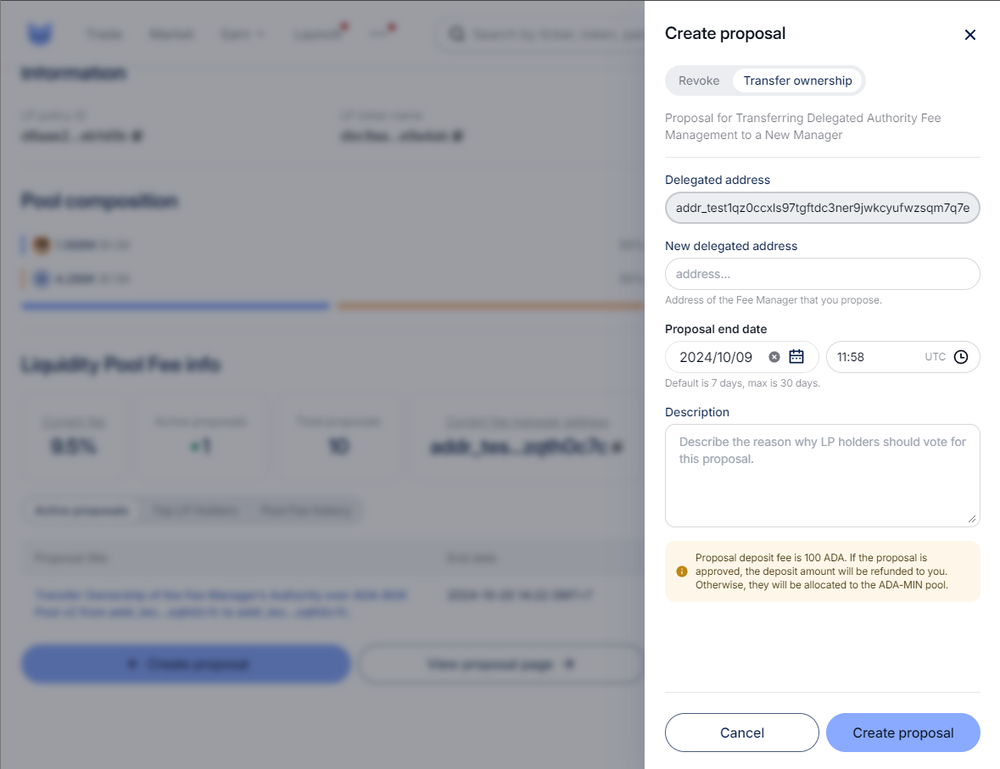
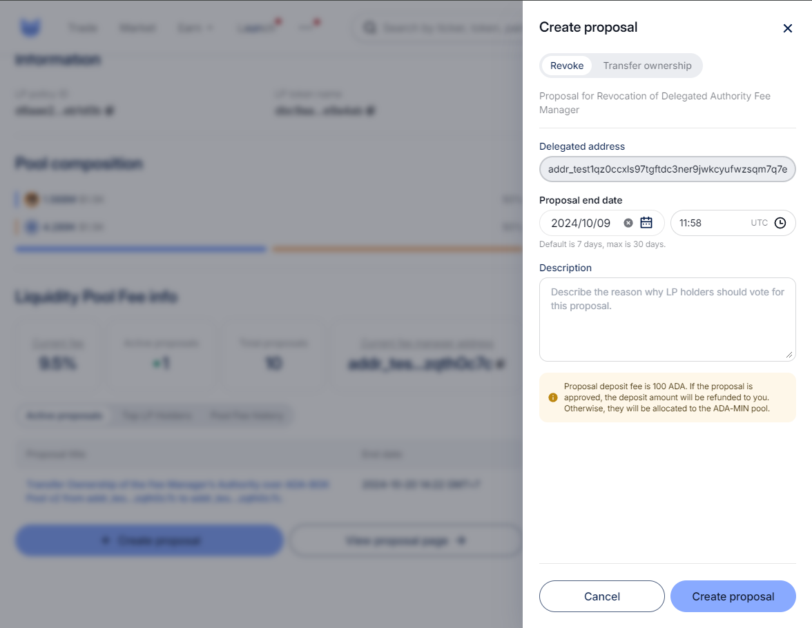

# Create LP Fee Governance

### **Create Proposal**

There are two entries to create a proposal:

* In the Pool detail page, users (LP holders) will see a “Create proposal” button at the bottom which opens the “Create proposal” drawer.

<figure><figcaption></figcaption></figure>

* In the LP fee proposals page, navigate from the “View proposal page" button at the bottom of the Pool detail page, and then users (LP holders) will see a “Create proposal” button

<figure><figcaption></figcaption></figure>

Creating a delegation proposal requires:

* Delegated address
* Proposal period
* Description
* 100 ADA for submitting

<figure><figcaption>
Delegation Proposal
</figcaption></figure>

<figure><figcaption>
Transfer Ownership Proposal
</figcaption></figure>

<figure><figcaption>
Revoke Proposal
</figcaption></figure>

