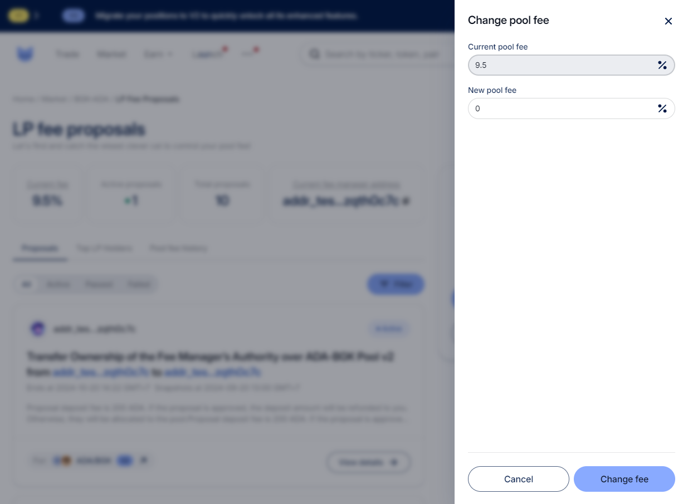

# Fee Manager - Change the Pool Fee

As a Fee Manager, you will see that the “Change fee” button is enabled on the LP fee proposals page.&#x20;

<figure><figcaption></figcaption></figure>

An example for changing the fee&#x20;

<figure><figcaption></figcaption></figure>
