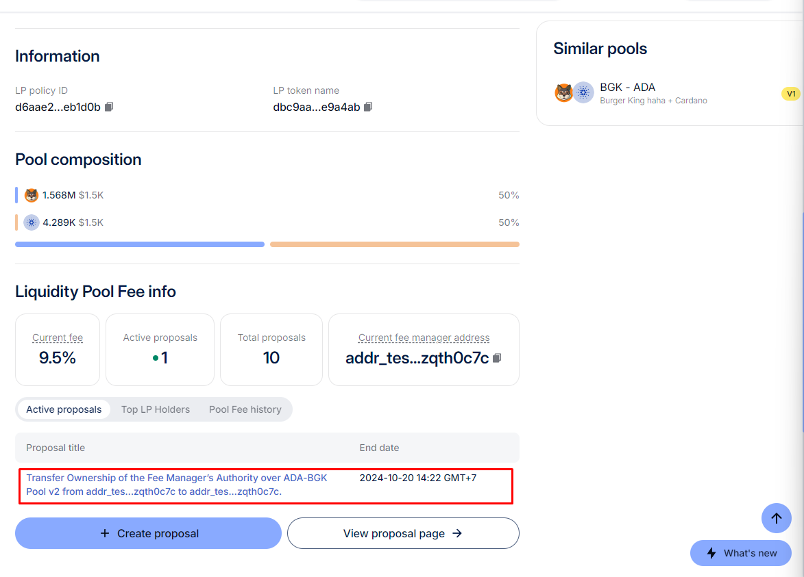
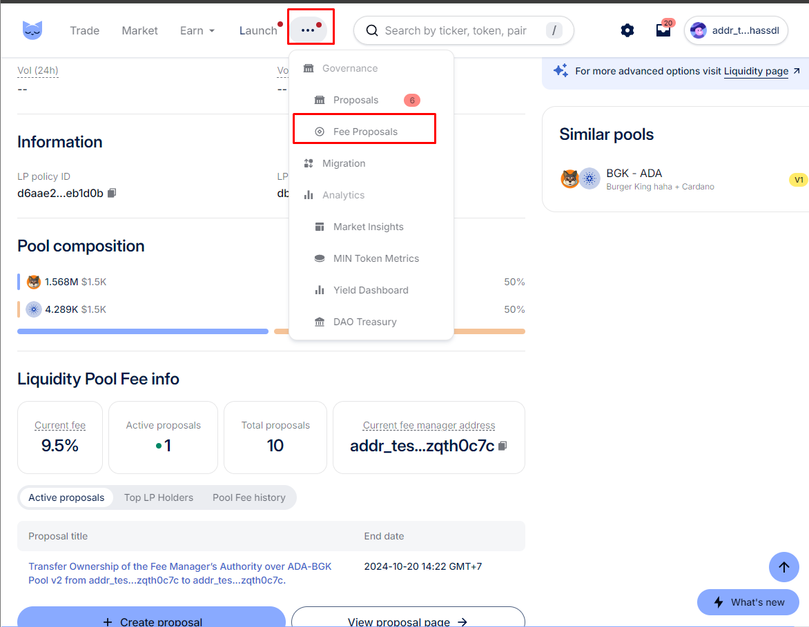
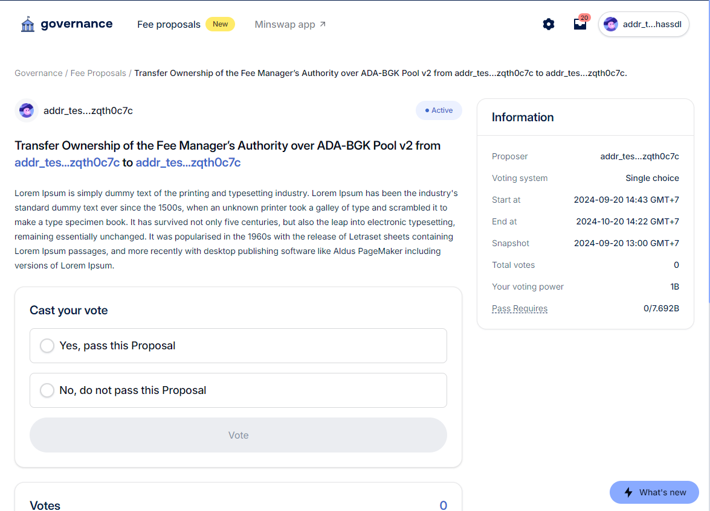

# Vote for an LP Fee Proposal

## **Enter a Proposal**

There are two ways to access proposal details:

* From the Pool detail by clicking on an Active proposal.

<figure><figcaption></figcaption></figure>

* From Menu > More > Fee Proposals and then choosing the desired proposal.

<figure><figcaption></figcaption></figure>

## Voting for a Proposal

In the proposal details, users can make their selection if they meet the qualifications in the snapshot data.

<figure><figcaption></figcaption></figure>
