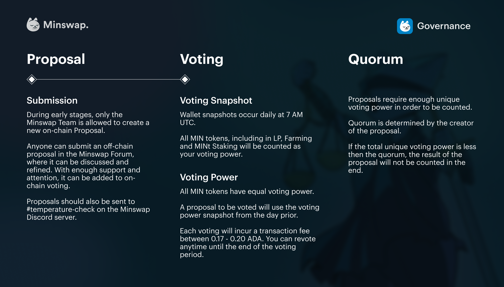

# Proposals & Snapshot Voting

## Proposals

During the first iteration of the Minswap Governance module, only the Minswap Core Team can create Proposals (by creating a normal transaction and attaching Proposal information in the transaction metadata). However, anyone is free to post Proposals in the Minswap Forum. Provided it gathers enough support and attention, the Proposal will be added to on-chain voting. If you want to submit a Proposal for on-chain voting please also ensure it is shared on the **#🌡┃temperature-check** channel on the Minswap Discord.

## **Snapshot Voting**

There will be an automatic **snapshot** of wallets _everyday at 7 AM UTC_. The snapshot will capture the amount of MIN, the MIN in MIN-ADA LP Tokens, the MIN in MIN-ADA LP in Yield Farming and the MIN in the MINt staking system in anyone’s wallets. It's not necessary to unstake LP Tokens to access snapshot voting.

**Voting Power** will be the same for MIN regardless of whether it is liquid, in LP, staked or in MINt Staking. As such:

_Voting Power for 1 MIN in wallet = Voting Power for 1 MIN in MIN-ADA LP Tokens = Voting Power for 1 MIN in staked MIN-ADA LP Tokens = Voting Power for 1 MIN in MINt staking_

A Proposal to be voted on will use the Voting Power of a snapshot from **the day prior** (eg. a proposal starting on 10th November will be based on snapshot data from November 9th 7 AM UTC).

The **fee** for making a voting transaction is the standard blockchain transaction fee which is around 0.17-0.2 ADA. Moreover, users can change their mind on the answer and re-vote anytime between proposal’s start and end time.

**Quorum**

**Quorum** is the metric which requires the minimum of unique Voting Power of each proposal. If the proposal has the unique Voting Power less than Quorum, then the proposal won’t be approved. For a vote to pass and become binding, it must gain a quorum of at least **5% of the current $MIN circulating supply** (currently around 500 million $MIN) in Voting Power, meaning 25 million $MIN.

<figure><figcaption></figcaption></figure>

