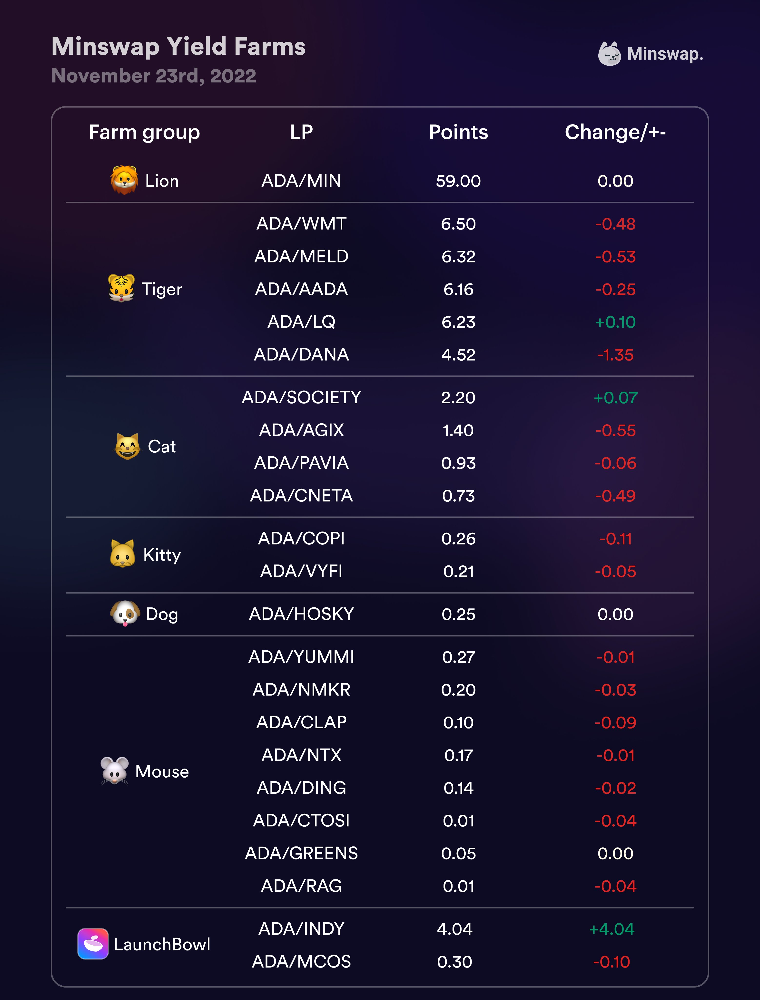
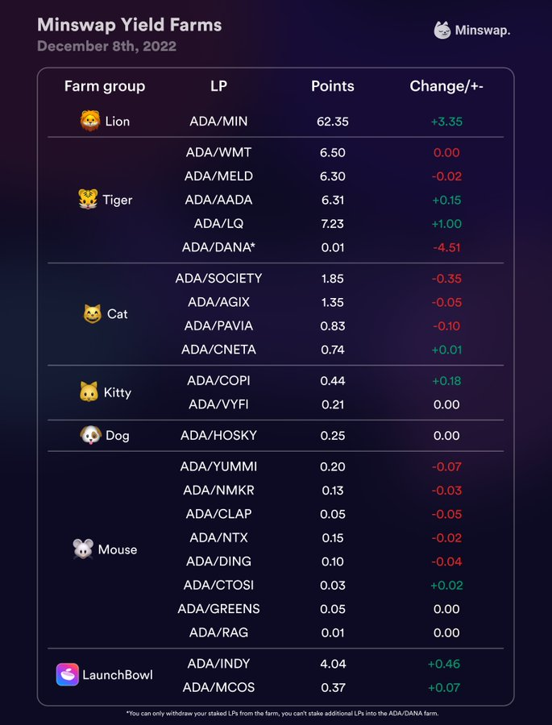
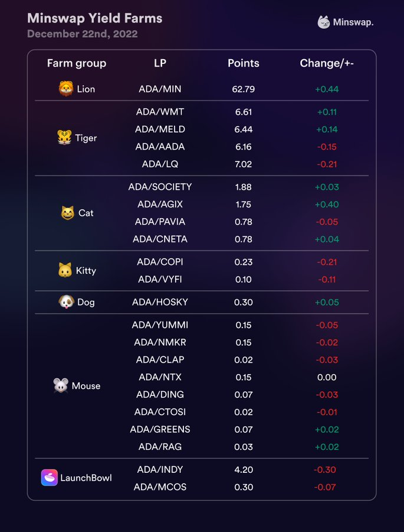
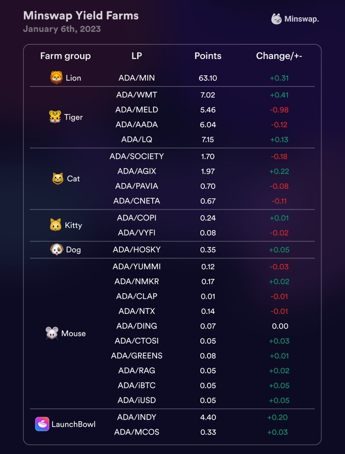
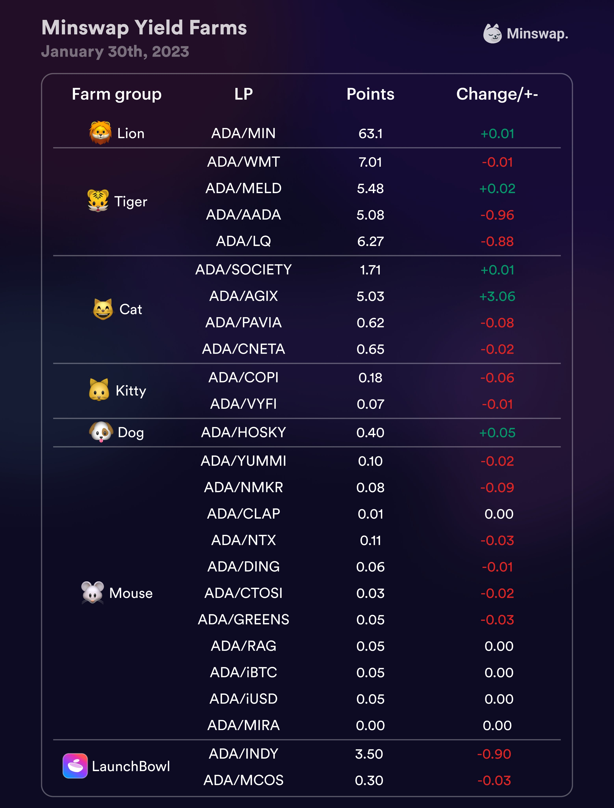

# Historical MIN Farm Rebalances

**Initial Farms:** starting on March 14th 2022

 (1).png>)

**1st Farm Rebalance:** on the 23rd of April 2022 new Farm Allocations were the following:

.png>)

**2nd Farm Rebalance:** on the 23rd of May 2022 new Farm Allocations were the following:

&#x20; (1).png>)

**3rd Farm Rebalance:** on the 7th of June 2022 new Farm Allocations were the following:

 (1).png>)

**4th Farm Rebalance:** on the 21st of June 2022 new Farm Allocations were the following:

 (1) (1).png>)

**5th Farm Rebalance:** on the 7th of July 2022 new Farm Allocations were the following:

.png>)

**6th Farm Rebalance:** on the 26th of July 2022 new Farm Allocations were the following:

 (1) (3).png>)

**7th Farm Rebalance:** on August 10th 2022 new Farm Allocations were the following:

.png>)

**8th Farm Rebalance:** on August 25th 2022 new Farm Allocations were the following:

 (1).png>)

**9th Farm Rebalance:** on September 8th 2022 new Farm Allocations were the following:

.png>)

**10th Farm Rebalance:** on September 23rd 2022 new Farm Allocations were the following:

.png>)

**11th Farm Rebalance:** on October 10th 2022 new Farm Allocations were the following:

.png>)

**12th Farm Rebalance:** on October 24th 2022 new Farm Allocations were the following:

<figure><figcaption></figcaption></figure>

**13th Farm Rebalance:** on November 9th 2022 new Farm Allocations were the following:

<figure><figcaption></figcaption></figure>

**14th Farm Rebalance:** on November 23rd 2022 new Farm Allocations were the following:

<figure><figcaption></figcaption></figure>

**15h Farm Rebalance:** on December 8th 2022 new Farm Allocations were the following:

<figure><figcaption></figcaption></figure>

**16th Farm Rebalance:** on December 22nd 2022 new Farm Allocations were the following:

<figure><figcaption></figcaption></figure>

**17th Farm Rebalance:** on January 6th 2023 new Farm Allocations were the following:

<figure><figcaption></figcaption></figure>

**18th Farm Rebalance:** on January 23rd 2023 new Farm Allocations were the following:

<figure><figcaption></figcaption></figure>

**19th Farm Rebalance:** on February 7th 2023 new Farm Allocations were the following:

<figure><figcaption></figcaption></figure>

**20th Farm Rebalance:** on February 23rd 2023 new Farm Allocations were the following:

<figure><figcaption></figcaption></figure>

**21st Farm Rebalance:** on March 9th 2023 new Farm Allocations were the following:

<figure><figcaption></figcaption></figure>

**22nd Farm Rebalance:** on March 24th 2023 new Farm Allocations were the following:

<figure><figcaption></figcaption></figure>

**23rd Farm Rebalance:** on April 7th 2023 new Farm Allocations were the following:

<figure><figcaption></figcaption></figure>

**24th Farm Rebalance:** on April 21st 2023 new Farm Allocations were the following:

<figure><figcaption></figcaption></figure>
