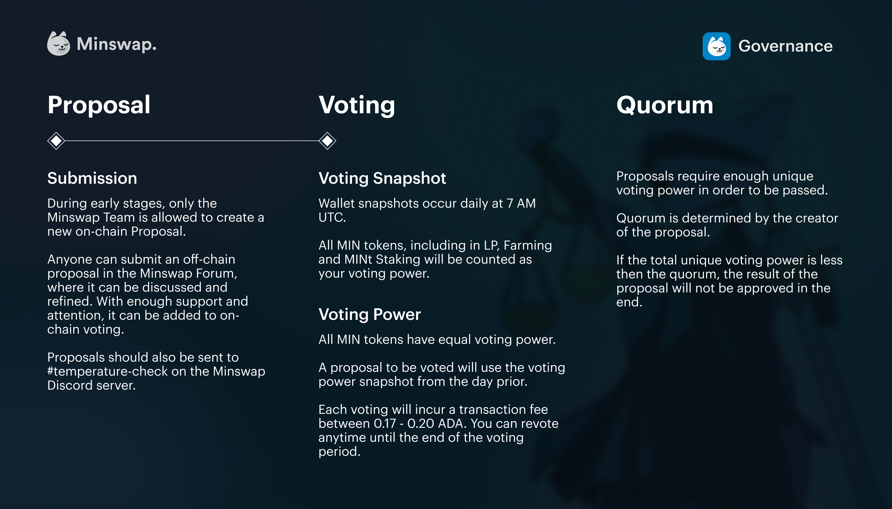

# Historical MIN Farm Rebalances

**Initial Farms:** starting on March 14th 2022

****.png>)****

**1st Farm Rebalance:** on the 23rd of April 2022 new Farm Allocations were the following:

.png>)

**2nd Farm Rebalance:** on the 23rd of May 2022 new Farm Allocations were the following:

&#x20; (1).png>)

**3rd Farm Rebalance:** on the 7th of June 2022 new Farm Allocations were the following:

 (1).png>)

**4th Farm Rebalance:** on the 21st of June 2022 new Farm Allocations were the following:

 (1) (1).png>)

**5th Farm Rebalance:** on the 7th of July 2022 new Farm Allocations were the following:

.png>)

**6th Farm Rebalance:** on the 26th of July 2022 new Farm Allocations were the following:

.png>)

**7th Farm Rebalance:** on August 10th 2022 new Farm Allocations were the following:

.png>)

**8th Farm Rebalance:** on August 25th 2022 new Farm Allocations were the following:

**9th Farm Rebalance:** on September 8th 2022 new Farm Allocations were the following:

.png>)

