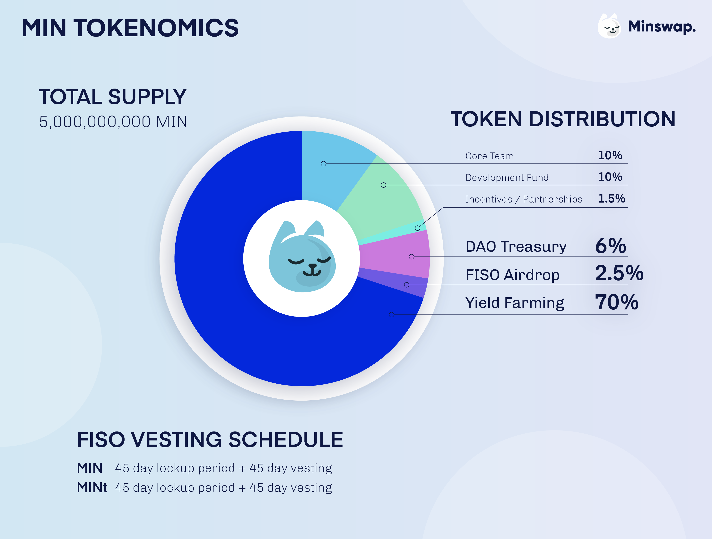

# Historical MIN Farm Rebalances

**Initial Farms:** starting on March 14th 2022

****.png>)****

**1st Farm Rebalance:** on the 23rd of April 2022 new Farm Allocations were the following:

.png>)

**2nd Farm Rebalance:** on the 23rd of May 2022 new Farm Allocations were the following:

&#x20;.png>)

**3rd Farm Rebalance:** on the 7th of June 2022 new Farm Allocations were the following:

**4th Farm Rebalance:** on the 21st of June 2022 new Farm Allocations were the following:

.png>)
